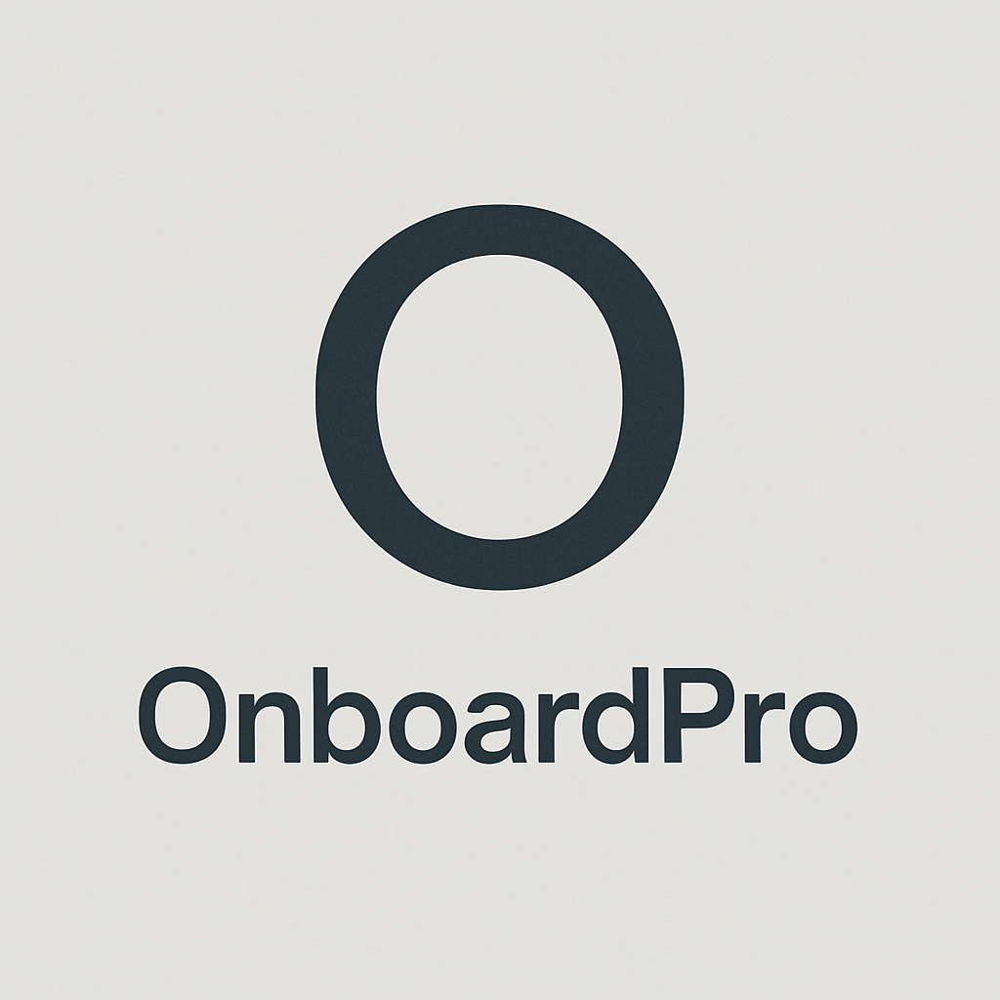

# 🚀 OnboardPro



## Обзор

OnboardPro — это современное веб-приложение, разработанное для оптимизации процесса адаптации новых сотрудников. Оно предоставляет инструменты для HR-менеджеров, руководителей отделов и сотрудников для управления задачами, сбора обратной связи и отслеживания прогресса.

## 📣 Последние обновления (28 апреля 2025)

- 🎨 **Унифицированный дизайн модальных окон** во всем приложении для повышения удобства использования
- 📊 Улучшенный интерфейс Profiles с фильтрацией и поиском
- 🔍 **Расширенный функционал фильтрации и сортировки задач** в панели управления менеджера
- 🔄 **Обновление данных** из базы данных для задач и планов через новую кнопку "Обновить"
- 🔒 Улучшенный функционал сброса паролей с более удобным интерфейсом
- 📱 Стандартизированный формат телефонных номеров

## ⚡️ Технологии

- 🏗 **Бэкенд**: FastAPI, SQLite, SQLAlchemy, Alembic для миграций
- 🎨 **Фронтенд**: React, TailwindCSS с PostCSS 8, адаптивный дизайн
- 🔐 **Аутентификация**: JWT
- 🐳 **Контейнеризация**: Docker, docker-compose
- 🧪 **Тестирование**: Pytest для бэкенда, нагрузочное тестирование
- 🤖 **Интеграции**: Telegram, Google Calendar, Workable

## ✨ Возможности

- 👥 Аутентификация пользователей с ролями (employee, manager, hr)
- 🔒 Система ролей и разграничения доступа
- 📱 Современный адаптивный интерфейс
- 🎨 Унифицированный дизайн модальных окон с интуитивно понятной структурой
- 📋 Создание и управление планами онбординга
- ✅ Отслеживание прогресса выполнения задач
- 🎯 Приоритизация задач (высокий, средний, низкий)
- 📊 Расширенная фильтрация задач:
  - По статусу (завершено, в процессе, в очереди)
  - По приоритету (высокий, средний, низкий)
  - По сотруднику и плану адаптации
  - По названию и описанию через поиск
- 🔄 Сортировка задач по названию, сроку, приоритету и статусу
- 🔄 Обновление данных из базы через специальную кнопку "Обновить"
- 👀 Разные представления для сотрудников и менеджеров
- 📈 HR-дашборд с аналитикой и метриками
- 🔄 Интеграция с внешними сервисами
  - 📱 Уведомления через Telegram
  - 📅 Синхронизация с Google Calendar
  - 👥 Импорт сотрудников из Workable

## Быстрый старт

### Предварительные требования

- Docker и Docker Compose
- Node.js (v18+) и npm
- Python 3.11+

### Установка

1. Клонируйте репозиторий:

   ```
   git clone https://github.com/magna_mentes/OnboardPro.git
   cd OnboardPro
   ```

2. Запустите приложение:

   ```
   docker-compose up -d
   ```

3. Откройте приложение по адресу http://localhost:3000

4. Войдите, используя одни из следующих учетных данных:
   - HR: test@onboardpro.com / test123
   - Менеджер: manager@onboardpro.com / test123
   - Сотрудник: employee@onboardpro.com / test123

### Разработка

1. Установите зависимости:

   ```
   cd frontend
   npm install
   ```

2. Запустите сервер разработки:

   ```
   npm start
   ```

3. Запустите скрипт проверки настройки:
   ```
   ./validate_setup.sh
   ```

## 🛠 Установка

### 🐳 Запуск через Docker

```bash
# Клонируем репозиторий
git clone https://github.com/MagnaMentes/OnboardPro.git
cd OnboardPro

# Создаем файл .env с необходимыми переменными
cp backend/.env.example backend/.env

# Запускаем контейнеры
docker-compose up -d
```

### 🔧 Локальная установка (для разработки)

#### Бэкенд

```bash
cd backend
python -m venv venv
source venv/bin/activate  # для Linux/macOS
# или
venv\Scripts\activate  # для Windows
pip install -r requirements.txt
```

📝 Создайте файл `.env` в директории backend:

```
DATABASE_URL=sqlite:///onboardpro.db
SECRET_KEY=your-secret-key
TELEGRAM_BOT_TOKEN=your-telegram-bot-token
GOOGLE_CREDENTIALS_PATH=/path/to/credentials.json
WORKABLE_API_KEY=your-workable-api-key
```

#### Фронтенд

```bash
cd frontend
npm install
npm run build
```

## 🚀 Запуск

### 🐳 Docker (рекомендуется)

```bash
docker-compose up -d
```

Приложение будет доступно:

- Фронтенд: http://localhost:3000
- API: http://localhost:8000
- Swagger UI: http://localhost:8000/docs

### 🔧 Локальный запуск (для разработки)

#### Бэкенд

```bash
cd backend
source venv/bin/activate  # для Linux/macOS
# или
venv\Scripts\activate  # для Windows
uvicorn main:app --host 0.0.0.0 --port 8000 --reload
```

#### Фронтенд

```bash
cd frontend
npm run start
```

## 🧪 Тестирование

### Модульное тестирование

```bash
cd backend
pytest tests/test_api.py -v
```

### Нагрузочное тестирование

```bash
# Запуск нагрузочного тестирования
./run_load_test.sh

# Анализ результатов
python backend/analyze_load_test.py
```

Подробнее о нагрузочном тестировании читайте в [load_testing_guide.md](load_testing_guide.md).

## Документация

- [Руководство пользователя (Русский)](docs/user_guide_ru.md)
- [Руководство пользователя (Английский)](docs/user_guide_en.md)
- [Техническая документация (Русский)](docs/technical_documentation_ru.md)
- [Техническая документация (Английский)](docs/technical_documentation.md)
- [Архитектура](docs/architecture.md)
- [Журнал разработки (Русский)](docs/developer_log_ru.md)
- [Журнал разработки (Английский)](docs/developer_log.md)
- [Отчет спринта 5.5](docs/sprint_5.5_report.md)
- [Отчёт валидации спринтов 1-5.5](docs/sprints_1_5.5_validation_report.md)

## 📁 Структура проекта

```
OnboardPro/
├── backend/              # FastAPI бэкенд
│   ├── migrations/       # Миграции Alembic
│   ├── tests/            # Тесты бэкенда
│   ├── __init__.py       # Инициализация пакета
│   ├── auth.py           # Аутентификация и авторизация
│   ├── database.py       # Настройки базы данных
│   ├── integrations.py   # Внешние интеграции
│   ├── main.py           # Основной файл приложения
│   ├── models.py         # Модели данных
│   └── onboardpro.db     # SQLite база данных
├── frontend/             # React фронтенд
│   ├── public/           # Статические файлы
│   ├── src/              # Исходный код
│   │   ├── components/   # React компоненты
│   │   └── pages/        # Компоненты страниц
│   └── package.json      # Зависимости
├── docs/                 # Документация
├── logs/                 # Логи приложения
├── docker-compose.yml    # Основная Docker конфигурация
├── docker-compose.loadtest.yml # Конфигурация для нагрузочного тестирования
└── README.md             # Этот файл
```

## 💻 Разработка

### ⚙️ Требования

- 🐍 Python 3.11+
- 📦 Node.js 18+
- 🔧 npm 9+
- 🐳 Docker & docker-compose (для запуска через контейнеры)

### 📝 Рекомендации по разработке

1. 🔧 Используйте виртуальное окружение Python
2. 🔄 Следите за обновлениями зависимостей
3. ✨ Соблюдайте стиль кода проекта
4. 🐳 Тестируйте изменения в Docker-окружении
5. 🧪 Пишите тесты для нового функционала

## Лицензия

© 2025 magna_mentes. Все права защищены.

## Поддержка

Для технической поддержки обращайтесь к команде разработки по адресу support@onboardpro.com
